# StethoAgent — AI 건강 가이드 시스템 기술 보고서

> 본 문서는 StethoAgent 시스템의 기술적 구조와 비즈니스 확장 가능성을 비전문가도 이해할 수 있도록 설명합니다.

---

## 1. 한 줄 요약

**"청진기 소리, 심박수, 증상을 입력하면 여러 AI 전문가가 동시에 분석하고 종합 건강 가이드를 제공하는 시스템"**

---

## 2. 이 시스템이 해결하는 문제

### 현재 상황의 문제점

의료 현장에서 환자의 건강 상태를 판단하려면 여러 정보를 종합해야 합니다:

| 정보 | 현재 방식 | 문제 |
|------|----------|------|
| 폐 청진음 | 의사가 청진기로 듣고 경험으로 판단 | 숙련도에 따라 정확도 차이 큼 |
| 생체 신호 (심박수, 혈압, 체온) | 수치만 확인 | 다른 정보와의 연관성 분석이 어려움 |
| 증상 | 환자 면담 | 표현의 모호성, 누락 가능 |
| 종합 판단 | 의사의 경험과 지식 | 시간 부족, 정보 과부하 |

### StethoAgent의 접근

```
기존: 의사 1명이 모든 정보를 혼자 분석

StethoAgent: AI 전문가 7명이 동시에 협력 분석
  ├── 입력 검증 AI — "데이터가 정확한가?"
  ├── 청진음 전문 AI — "폐 소리에서 이상은 없는가?"
  ├── 생체신호 전문 AI — "심박수/혈압/체온이 정상인가?"
  ├── 증상 분석 AI — "증상 조합이 무엇을 의미하는가?"
  ├── 종합 판단 AI — "3개 분석을 종합하면 어떤 결론인가?"
  ├── 위험도 평가 AI — "얼마나 긴급한가?"
  └── 건강 가이드 AI — "사용자에게 어떻게 설명하면 되는가?"
```

> 비유하자면, **한 명의 의사가 모든 것을 판단하는 대신, 7명의 전문의 팀이 환자 하나를 놓고 회의하는 것**과 같습니다.

---

## 3. 멀티 에이전트 시스템이란?

### 쉬운 설명

"에이전트(Agent)"란 **특정 역할을 맡은 AI 프로그램**입니다.

일반 AI 챗봇(예: ChatGPT)은 **하나의 AI가 모든 질문에 답합니다**. 반면, 멀티 에이전트 시스템은 **여러 전문 AI가 역할을 나누어 협력합니다**.

### 실생활 비유: 종합병원

```
🏥 종합병원에 가면...

접수 → 내과 → 영상의학과 → 검사실 → 다시 내과 → 진단

각 부서가 전문 영역을 담당하고, 최종적으로 담당 의사가 종합 판단을 내립니다.
```

StethoAgent도 이와 같은 구조입니다:

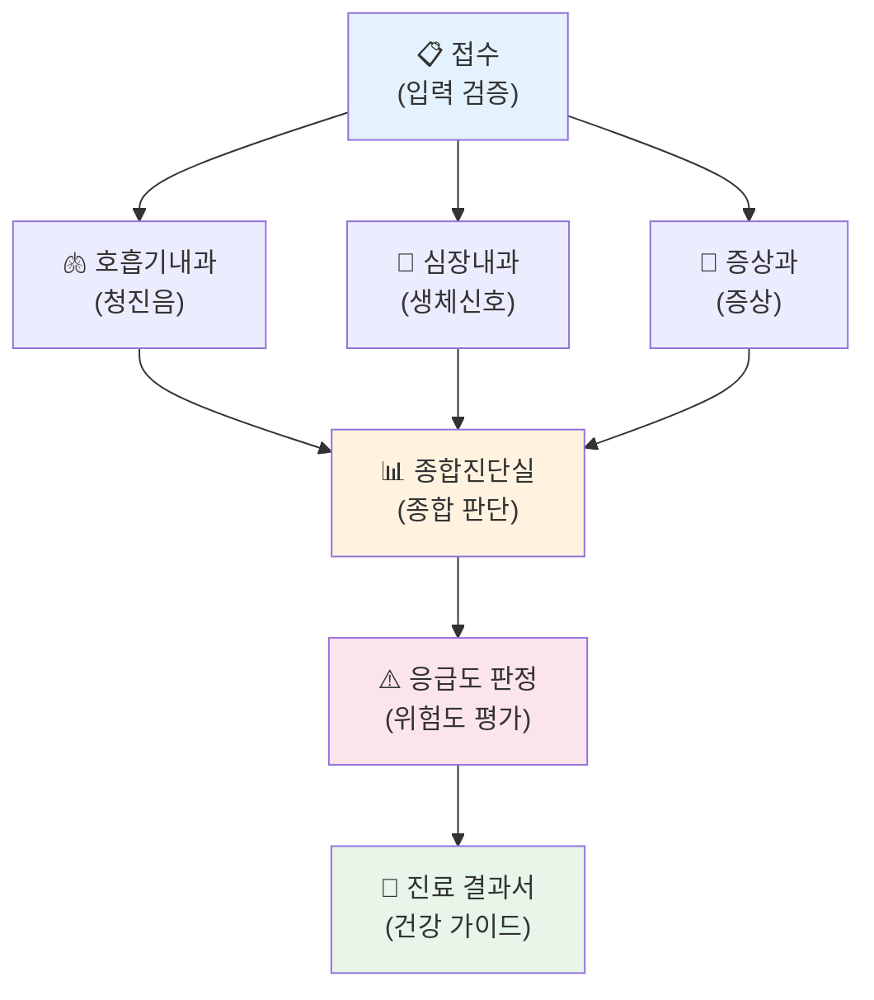

### 왜 "멀티"여야 하는가?

| 방식 | 장점 | 단점 |
|------|------|------|
| **단일 AI** (하나가 다 함) | 구조가 단순 | 복잡한 문제에서 정확도 낮음, 과정 불투명 |
| **멀티 에이전트** (역할 분담) | 각 영역 전문성 높음, 과정 추적 가능, 병렬 처리로 빠름 | 구조 설계 필요 |

실제 차이를 보면:

```
❌ 단일 AI에게 질문:
   "청진음에서 수포음이 들리고, 심박수 130, 체온 39도, 기침이 심한데 어때?"
   → "주의가 필요합니다." (과정이 보이지 않음)

✅ 멀티 에이전트:
   청진음 AI: "수포음(Crackle) 감지, 신뢰도 92% → 폐렴 가능성"
   생체신호 AI: "빈맥(130bpm) + 발열(39°C) → 감염 의심"
   증상 AI: "기침+호흡곤란+발열 → 하기도 감염 패턴"
   종합 AI: "3개 분석이 일관되게 폐렴을 시사함, PubMed 문헌 3건 확인"
   위험도 AI: "HIGH (65점) — 빈맥+발열+수포음 복합 위험"
   가이드 AI: "⚠️ 즉시 병원 방문이 필요합니다. 폐렴 가능성이 있습니다."
```

---

## 4. 현재 시스템 구조

### 4.1 전체 시스템 구조도

시스템은 3개 층(Layer)으로 구성됩니다. 건물의 1층(모델), 2층(에이전트), 3층(화면)과 같습니다.

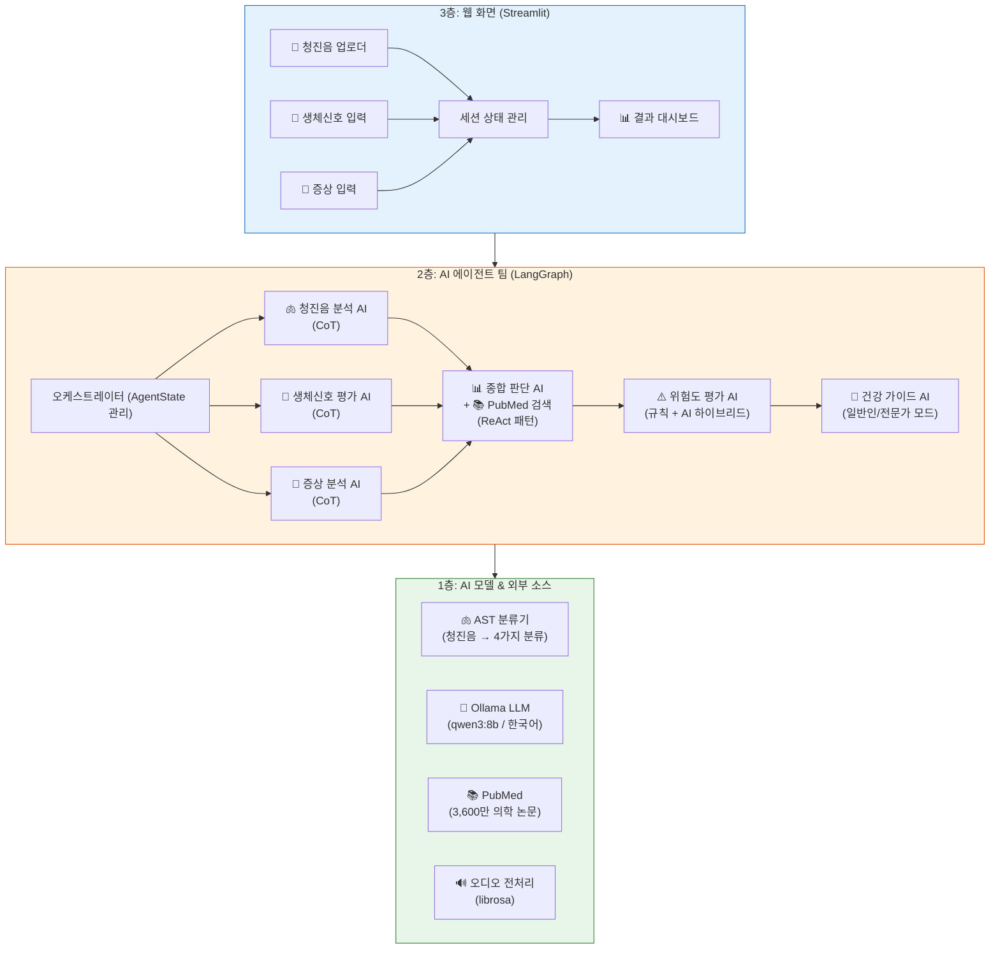

> 핵심 설계 원칙: **모든 처리가 사용자의 컴퓨터(로컬) 안에서 실행**됩니다.
> 환자 데이터가 외부 서버로 전송되지 않습니다. (PubMed 검색 시에도 환자 정보는 전송하지 않음)

### 4.2 상태 그래프 (State Graph)

"상태 그래프"란 **AI 에이전트들이 어떤 순서로, 어떤 조건에서 작동하는지를 정의한 설계도**입니다.
공장의 생산 라인처럼, 각 단계가 정해진 순서와 규칙에 따라 실행됩니다.

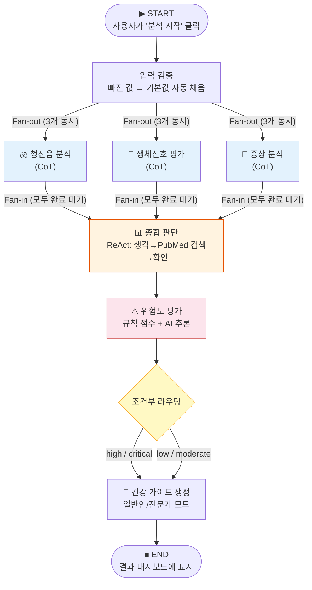

**Fan-out / Fan-in** 이란?
- **Fan-out (펼치기)**: 하나의 작업이 끝나면 여러 작업을 동시에 시작
- **Fan-in (모으기)**: 여러 작업이 모두 끝나면 다음 단계로 진행
- 마치 **시험에서 3개 과목을 동시에 채점**하고, 모든 채점이 끝나면 총점을 계산하는 것과 같습니다

### 4.3 데이터 흐름

데이터가 시스템을 통과하며 어떻게 변환되는지를 보여줍니다.

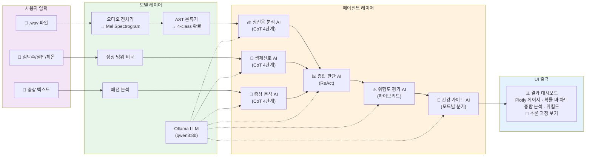

**데이터 변환 단계 요약:**

| 단계 | 입력 | 처리 | 출력 |
|------|------|------|------|
| 오디오 | .wav (원본) | 16kHz 모노 변환 → AST 분류 | Normal/Crackle/Wheeze/Both + 확률 |
| 생체신호 | 숫자 3개 (HR/BP/Temp) | 정상 범위 비교 → LLM 해석 | 이상 소견 텍스트 |
| 증상 | 텍스트 + 체크리스트 | 패턴 매칭 → LLM 분석 | 증상 조합 분석 텍스트 |
| 종합 | 3개 분석 텍스트 | LLM 종합 + PubMed 검색 | 종합 소견 + 문헌 근거 |
| 위험도 | 종합 소견 + 원본 데이터 | 규칙 점수 + LLM 보정 | 레벨(low~critical) + 점수(0~100) |
| 가이드 | 종합 + 위험도 + 모드 | LLM 생성 | 건강 가이드 텍스트 |

### 4.4 워크플로우 상세

```
사용자가 3가지를 입력합니다:

  🎵 청진음 파일 (.wav)     → 녹음한 폐 소리
  💓 생체 신호               → 심박수, 혈압, 체온
  📝 증상                    → "기침이 있고 숨이 찹니다"
```

### 4.2 각 AI 에이전트의 역할

#### 에이전트 1: 청진음 분석 AI

```
입력: 폐 소리 녹음 파일 (.wav)

처리 과정:
  1. 소리 파일을 AI가 이해할 수 있는 형태(스펙트로그램)로 변환
  2. 딥러닝 모델(AST)이 4가지로 분류:
     - Normal (정상)
     - Crackle (수포음 — 폐렴 등에서 들림)
     - Wheeze (천명음 — 천식 등에서 들림)
     - Both (수포음 + 천명음)
  3. LLM이 분류 결과를 의학적으로 해석

출력 예시:
  "[1단계] 분류 결과: Crackle (수포음), 신뢰도 92%
   [2단계] 신뢰도가 높아 결과를 신뢰할 수 있습니다
   [3단계] 수포음은 폐렴, 폐부종, 간질성 폐질환에서 관찰됩니다
   [4단계] 비정상 소견으로, 추가 검사가 권장됩니다"
```

#### 에이전트 2: 생체신호 분석 AI

```
입력: 심박수(bpm), 혈압(mmHg), 체온(°C)

처리 과정:
  1. 정상 범위와 비교 (심박수 60-100, 혈압 90-120/60-80, 체온 36.1-37.2)
  2. 이상치 식별 및 임상적 의미 분석
  3. 여러 이상치 간의 연관성 분석

출력 예시:
  "[1단계] 심박수 130bpm — 빈맥 (정상 범위 초과)
   [2단계] 체온 39.0°C — 고열 (감염 의심)
   [3단계] 빈맥+발열 동시 → 감염에 의한 보상성 빈맥 가능성
   [4단계] 긴급 의료 평가 권장"
```

#### 에이전트 3: 증상 분석 AI

```
입력: 자유 텍스트 + 체크리스트(기침, 호흡곤란, 가슴통증 등) + 기간 + 강도

처리 과정:
  1. 증상 키워드 추출
  2. 증상 조합 패턴 분석 (예: 기침+가래+발열 → 감염성 질환)
  3. 위험 신호 식별 (예: 가슴 통증+호흡곤란 → 심혈관 의심)

출력 예시:
  "[1단계] 핵심 증상: 기침(습성), 호흡곤란, 발열
   [2단계] 기침+발열+호흡곤란 → 하기도 감염 패턴
   [3단계] 지속 기간 3-7일 → 급성 경과
   [4단계] 폐렴 감별을 위한 추가 검사 권장"
```

#### 에이전트 4: 종합 판단 AI (ReAct 패턴)

이 에이전트는 특별한 방식으로 작동합니다 — **생각하고, 행동하고, 관찰하는 순환**을 반복합니다:

```
[사고] 🧠 "3개 분석 결과를 보니, 모두 폐렴을 시사하고 있다"
[행동] ⚡  PubMed에서 "crackle fever cough pneumonia" 검색 실행
[관찰] 👁️ "관련 논문 3건 발견 — community-acquired pneumonia 진단 기준과 일치"
[결론] ✅  "청진음, 생체신호, 증상이 일관되게 지역사회 획득 폐렴을 시사합니다"
```

> 이것이 바로 **ReAct(Reasoning + Acting) 패턴**입니다.
> 단순히 답을 내는 것이 아니라, AI가 **스스로 추가 정보를 검색하고 근거를 확인**한 후 결론을 내립니다.

#### 에이전트 5: 위험도 평가 AI (하이브리드 방식)

**규칙 기반 점수**와 **AI 추론**을 합칩니다:

```
[규칙 기반 — 빠르고 일관된 점수 산정]
  비정상 심박수(130bpm)  → +15점
  고혈압(160mmHg)        → +15점
  발열(39°C)             → +15점
  비정상 청진음(Crackle)  → +20점
  증상 강도(심함)         → +15점
  ─────────────────────────────
  합계                   → 80점

[AI 추론 — 맥락을 고려한 보정]
  "빈맥+발열+수포음의 조합은 단순 합산보다 위험합니다.
   이 패턴은 폐렴의 전형적 소견입니다."
  → 위험도: HIGH → CRITICAL로 상향 조정

[최종 결과]
  위험도: CRITICAL (80점)
  즉시 조치 필요: YES
  위험 요인: 빈맥, 고혈압, 발열, 비정상 청진음, 증상 심함
```

> 왜 둘을 합치는가?
> - **규칙만** 쓰면: 빠르지만, 맥락을 이해 못함 (기침 15점 + 발열 15점 = 30점이지만, 둘이 같이 있으면 더 위험)
> - **AI만** 쓰면: 맥락은 이해하지만, 가끔 엉뚱한 판단을 할 수 있음
> - **둘을 합치면**: 규칙으로 기본 점수를 깔고, AI가 맥락을 보고 보정 → **안정적이면서도 똑똑한 판단**

#### 에이전트 6: 건강 가이드 AI

**같은 분석 결과도 대상에 따라 다르게 설명합니다:**

```
일반인 모드:
  "현재 심장이 평소보다 빠르게 뛰고 있고, 열이 있는 상태입니다.
   폐에서 비정상적인 소리가 들리고 있어 가능한 빨리 병원에 방문하시는 것이
   좋겠습니다. 응급실 방문도 고려해 주세요."

전문가 모드:
  "임상 소견 요약:
   - 동성빈맥 130bpm, 고혈압 160/95mmHg, 발열 39.0°C
   - 양측 하폐야 수포음(crackle), 신뢰도 92%
   감별 진단: Community-acquired pneumonia (ICD-11: CA40)
   추천 검사: 흉부 X-ray, CBC+CRP, 혈액배양, 객담배양
   치료 고려: 경험적 항생제 (β-lactam + macrolide)"
```

---

## 5. AI가 "생각하는 과정"을 보여줍니다

### Chain-of-Thought (CoT) — 단계별 추론

#### CoT란 무엇인가?

**Chain-of-Thought(사고의 연쇄)**는 2022년 Google Brain 연구팀이 발표한 AI 추론 기법입니다
(논문: *"Chain-of-Thought Prompting Elicits Reasoning in Large Language Models"*, Wei et al., 2022).

핵심 아이디어는 단순합니다: **AI에게 "바로 답하지 말고, 단계별로 생각해서 답하라"고 지시하면 정확도가 크게 올라간다**는 것입니다.

```
비유: 수학 시험

❌ "답만 써라" → 학생이 실수해도 모르고 넘어감
✅ "풀이 과정을 써라" → 실수를 스스로 발견, 정확도 향상, 채점자도 검증 가능
```

이것이 의료 AI에서 특히 중요한 이유는, **의사가 AI의 판단 과정을 검증할 수 있어야** 임상 현장에서 신뢰하고 활용할 수 있기 때문입니다.

#### StethoAgent에서의 CoT 적용

```
❌ 일반 AI (CoT 미적용):
   Q: "심박수 130, 체온 39도, 수포음이 들립니다"
   A: "병원에 가세요"  ← 왜? 근거는? 과정은?

✅ StethoAgent (CoT 적용):
   [1단계] 심박수 130bpm은 빈맥, 체온 39°C는 고열
   [2단계] 수포음(crackle)은 폐 내 수분 축적을 시사
   [3단계] 빈맥+발열+수포음 = 폐 감염의 전형적 3대 소견
   [4단계] 결론: 폐렴 가능성이 높으며 즉시 의료 평가가 필요합니다
```

> StethoAgent의 **모든 분석 에이전트(청진음, 생체신호, 증상, 건강가이드)**가 이 4단계 CoT 패턴을 사용합니다.
> 각 단계의 내용은 `reasoning_trace`에 기록되어 UI에서 확인할 수 있습니다.

### ReAct — 생각하고 행동하는 AI

#### ReAct란 무엇인가?

**ReAct(Reasoning + Acting)**는 2023년 Princeton & Google 연구팀이 발표한 AI 패턴입니다
(논문: *"ReAct: Synergizing Reasoning and Acting in Language Models"*, Yao et al., 2023).

기존 CoT가 **"생각만 하는"** AI였다면, ReAct는 **"생각하다가 필요하면 직접 행동(도구 사용)하는"** AI입니다.

```
비유: 의사의 진료 과정

CoT만 쓰는 의사:
  "증상으로 보아 폐렴인 것 같다" (본인 지식만으로 판단)

ReAct를 쓰는 의사:
  [사고] "증상으로 보아 폐렴 같은데, 최신 논문에서 확인해보자"
  [행동] 의학 논문 검색 ← 직접 도구를 사용!
  [관찰] "최신 연구에서도 이 증상 조합의 폐렴 양성예측도가 85%"
  [결론] "임상 소견과 문헌 근거가 일치 → 폐렴 가능성 높음"
```

#### StethoAgent에서의 ReAct 적용

종합 판단 에이전트(`synthesis_node`)가 ReAct 패턴을 사용합니다:

```
[사고] 🧠 "수포음+발열+기침이 폐렴을 시사하는데, 최신 논문에서 확인해보자"
[행동] ⚡  PubMed 의학 논문 데이터베이스 검색 (3,600만 건)
[관찰] 👁️ "2024년 논문에서 crackle+fever의 폐렴 양성예측도 85%로 보고"
[결론] ✅  "의학 문헌 근거가 임상 소견과 일치합니다"
```

> 핵심 차이: CoT는 AI가 **자기 머릿속에서만** 생각하지만,
> ReAct는 AI가 **외부 도구(PubMed 검색)를 직접 사용**하여 근거를 확보합니다.
> StethoAgent에서 "행동" 단계는 PubMed 논문 검색이며, 향후 더 많은 도구(Google Scholar, ClinicalTrials.gov 등)가 추가될 예정입니다.

### 추론 추적 (Reasoning Trace) — 모든 과정 기록

시스템은 AI가 판단에 도달하는 **모든 사고 과정을 기록**합니다:

```
📝 추론 추적 기록:
  🧠 [사고] 휴리스틱 위험도 평가: high (65점), 요인: 빈맥, 발열, 수포음
  🧠 [사고] LLM 위험도 추론: 빈맥+발열+수포음은 폐렴 가능성, 위험도 high
  ⚡ [행동] LLM이 더 높은 위험도(high)를 제안하여 상향 조정합니다
  ✅ [결론] 최종 위험도: high (65점)
```

이 기록을 통해:
- **사용자**: "AI가 왜 이런 결론을 냈는지" 이해할 수 있음
- **의료진**: 판단 근거를 검증하고 신뢰 여부를 결정할 수 있음
- **개발자**: 시스템 개선 포인트를 식별할 수 있음

---

## 6. 기술적 차별점

### 6.1 완전한 로컬 실행 — 데이터가 외부로 나가지 않습니다

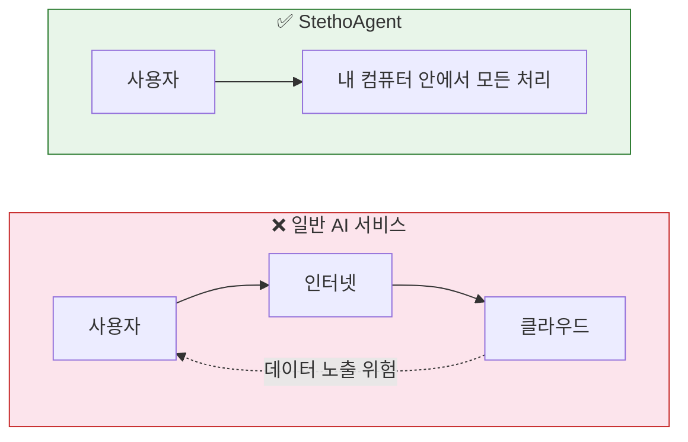

모든 AI 모델이 사용자의 로컬 환경에서 직접 실행됩니다:
- **LLM (언어 모델)**: Ollama — 로컬 서버에서 실행
- **청진음 분류 모델**: PyTorch — GPU 가속 (없으면 CPU 폴백)
- **문헌 검색**: PubMed 공개 API만 사용 (환자 정보 전송 없음)

### 6.2 병렬 분석 — 3개 분석이 동시에

```mermaid
gantt
    title 순차 vs 병렬 처리 비교
    dateFormat X
    axisFormat %s초

    section 순차 처리 (90초)
    청진음 분석   :a1, 0, 30
    생체신호 분석  :a2, after a1, 30
    증상 분석     :a3, after a2, 30

    section 병렬 처리 (~35초)
    청진음 분석   :b1, 0, 30
    생체신호 분석  :b2, 0, 30
    증상 분석     :b3, 0, 30
```

### 6.3 두 가지 사용자 모드

| | 일반인 모드 | 전문가 모드 |
|---|---|---|
| **대상** | 건강 관심 있는 일반인 | 의사, 간호사 등 의료인 |
| **언어** | "심장이 빨리 뛰고 있어요" | "동성빈맥 130bpm" |
| **포함 정보** | 생활 조언, 병원 방문 권고 | 감별 진단, ICD-11 코드, 추천 검사 |
| **예시** | "충분한 수분 섭취가 중요합니다" | "경험적 항생제 투여 고려 (β-lactam + macrolide)" |

### 6.4 의학 문헌 기반 근거

종합 판단 시 **PubMed(세계 최대 의학 논문 DB)를 자동 검색**하여 근거를 확보합니다.

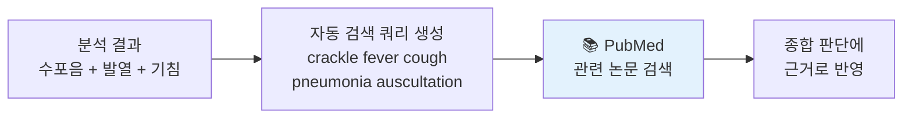

### 6.5 확장 가능한 구조

새로운 기능을 추가하기가 매우 쉽습니다:

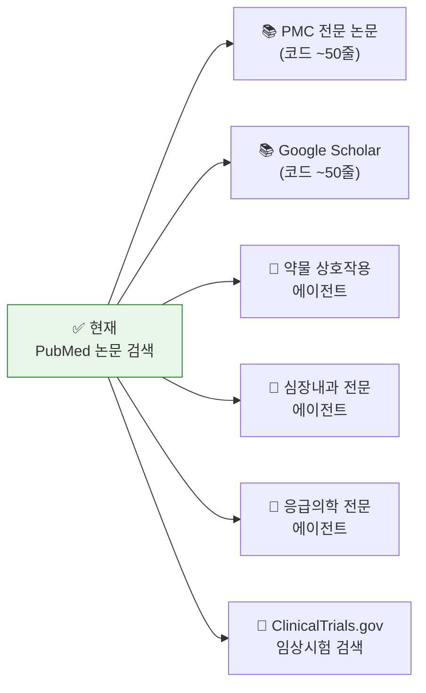

> 이것은 시스템이 **"확장 가능한 구조(Provider Pattern)"** 로 설계되어 있기 때문입니다.
> 새 기능은 레고 블록처럼 끼워 넣을 수 있습니다.

---

## 7. 시스템 구성 요소와 기술 스택

### 비전문가를 위한 설명

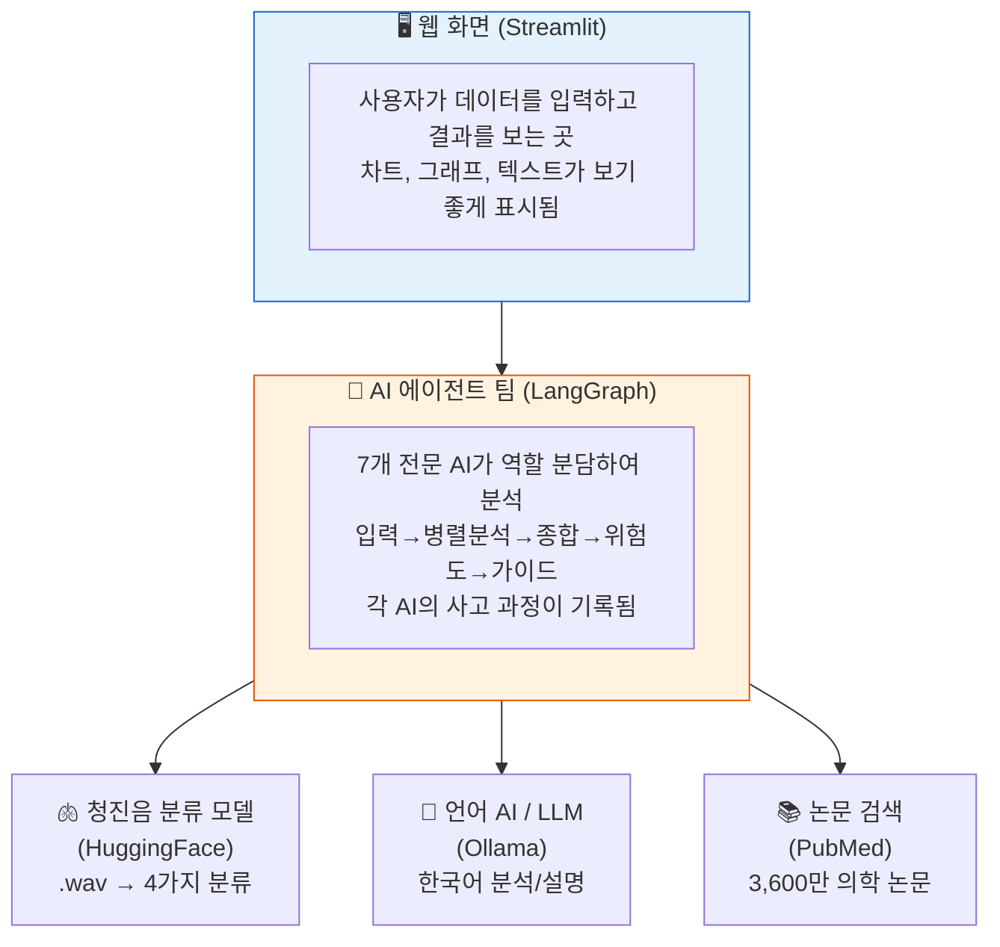

### 기술 스택 요약

| 구성요소 | 기술 | 역할 | 비유 |
|---------|------|------|------|
| 웹 UI | Streamlit | 사용자 화면 | 병원의 접수 창구 |
| AI 워크플로우 | LangGraph | 에이전트 조율 | 진료 프로세스 관리 |
| 언어 AI (LLM) | Ollama (qwen3:8b) | 분석, 판단, 설명 생성 | 의사의 두뇌 |
| 청진음 분류 | HuggingFace AST | 소리 → 분류 | 청진기 + 전문의 귀 |
| 시각화 | Plotly | 차트, 그래프 | 검사 결과지 |
| 데이터 검증 | Pydantic | 입력값 검증 | 접수 서류 확인 |

---

## 8. 시연 시나리오

### 시나리오 1: 건강한 사람의 정기 체크

```
입력:
  - 청진음: 없음 (미업로드)
  - 심박수: 75bpm, 혈압: 120/80, 체온: 36.5°C
  - 증상: "가벼운 기침이 있고 가끔 숨이 찹니다"

결과:
  위험도: LOW (15점)
  "현재 모든 생체 신호가 정상 범위입니다.
   가벼운 기침 증상은 건조한 환경이나 가벼운 감기로 인한 것일 수 있습니다.
   충분한 수분 섭취와 적절한 실내 습도 유지를 권장합니다.
   증상이 2주 이상 지속되면 의료 기관 방문을 권장합니다."
```

### 시나리오 2: 폐렴 의심 환자

```
입력:
  - 청진음: 수포음(Crackle) 감지, 신뢰도 92%
  - 심박수: 130bpm, 혈압: 160/95, 체온: 39.0°C
  - 증상: 심한 기침, 호흡곤란, 발열 (기간: 3-7일, 강도: 심함)

결과:
  위험도: HIGH (65점) ⚠️ 즉시 조치 필요

  일반인 모드:
    "⚠️ 중요: 현재 여러 건강 지표에서 주의가 필요한 상태입니다.
     심장이 평소보다 빠르게 뛰고 있고, 열이 높습니다.
     폐에서 비정상적인 소리가 감지되었습니다.
     가능한 빨리 가까운 병원(응급실)을 방문하시기를 강력히 권합니다."

  전문가 모드:
    "임상 소견 요약: 동성빈맥 130bpm, 고혈압 160/95, 발열 39.0°C
     양측 하폐야 수포음 (AST 분류 신뢰도 92%)
     감별 진단: Community-acquired pneumonia (ICD-11: CA40)
     추천 검사: 흉부 X-ray PA/Lat, CBC with diff, CRP/PCT, 객담 G/S+C/S
     참고 문헌: [PubMed 검색 결과 3건]"
```

### 시나리오 3: 아무 입력 없이 데모

```
입력: 없음 (버튼만 클릭)
  → 시스템이 자동으로 기본값을 채움:
    심박수 75, 혈압 120/80, 체온 36.5
    "가벼운 기침이 있고 가끔 숨이 찹니다"

결과: 정상 범위의 건강 가이드 출력
  → 투자자/데모 시연에서 바로 보여줄 수 있음
```

---

## 9. 비즈니스 확장 가능성

### 9.1 단기 확장 (3-6개월)

| 확장 | 설명 | 기대 효과 |
|------|------|----------|
| **문헌 검색 강화** | PMC 전문 논문, Google Scholar 추가 | 근거 기반 신뢰도 향상 |
| **다국어 지원** | 영어, 일본어 등 추가 | 해외 시장 진출 기반 |
| **모바일 대응** | 반응형 UI 최적화 | 사용자 접근성 향상 |
| **클라우드 배포** | AWS/GCP 서버 배포 | 대규모 사용자 서비스 |

### 9.2 중기 확장 (6-12개월)

| 확장 | 설명 | 기대 효과 |
|------|------|----------|
| **전문 진료과 에이전트** | 호흡기내과, 심장내과 전문 AI 추가 | 분석 깊이 향상 |
| **약물 상호작용** | 복용 약물 간 상호작용 확인 | 안전성 강화 |
| **웨어러블 연동** | Apple Watch 등 실시간 데이터 수집 | 지속적 모니터링 |
| **GraphRAG 건강 이력** | 그래프 DB로 사용자 패턴/생활로그 추적 | "단골 주치의" AI |
| **ICD-11 코드 매핑** | 증상/진단 → 국제 질병 분류 코드 자동 매핑 | 의료 표준화 |

### 9.3 장기 비전 (1-2년)

| 확장 | 설명 | 기대 효과 |
|------|------|----------|
| **멀티 에이전트 오케스트레이션** | 10+ 전문 에이전트 협업 | 종합 건강 플랫폼 |
| **임상 시험 연동** | ClinicalTrials.gov 검색 | 최신 치료법 추천 |
| **의료 AI SaaS** | API로 타 서비스에 제공 | B2B2C 수익 모델 |

### 9.4 타겟 시장

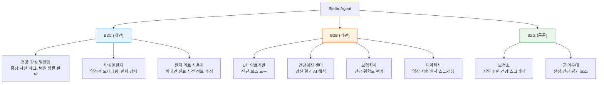

---

## 10. 현재 개발 상태

### 완성도

| 항목 | 상태 | 비고 |
|------|------|------|
| 핵심 AI 파이프라인 | ✅ 완료 | 청진음→분석→종합→가이드 전체 동작 |
| 멀티 에이전트 워크플로우 | ✅ 완료 | 7개 에이전트 병렬/순차 협업 |
| CoT/ReAct 추론 패턴 | ✅ 완료 | 모든 에이전트에 적용 |
| 웹 UI (대시보드) | ✅ 완료 | 입력, 차트, 결과 표시 |
| 의학 문헌 검색 | ✅ 완료 | PubMed 연동 |
| 테스트 | ✅ 143개 통과 | 단위/통합/E2E 테스트 |
| 로컬 실행 | ✅ 완료 | GPU 가속 + CPU 폴백 지원 |

### 실행 방법

```bash
# 원커맨드 셋업
./setup_mac.sh

# 실행
./run.sh              # 웹 UI
./run.sh test         # 테스트
./run.sh workflow     # CLI 테스트
./run.sh check        # 환경 확인
```

---

## 11. 향후 개발 계획 (TODO)

현재 핵심 파이프라인은 완성되었으며, 아래는 시스템을 더 강력하게 만들기 위한 확장 계획입니다.

### 11.1 의학 문헌 검색 소스 확장

현재 PubMed 한 곳에서 논문을 검색하지만, 여러 소스를 추가하면 **더 풍부하고 신뢰도 높은 근거**를 확보할 수 있습니다.

| 소스 | 설명 | 우선순위 | 난이도 |
|------|------|---------|--------|
| **PubMed** | 세계 최대 의학 논문 DB (3,600만 건) | ✅ 완료 | - |
| **PMC Open Access** | 전문(full-text) 논문 무료 검색 | P1 | 중 |
| **Google Scholar** | 인용 수 기반 논문 중요도 평가 | P2 | 중 |
| **Cochrane Library** | 체계적 문헌 고찰 — 최고 수준 근거 | P2 | 중 |
| **UpToDate / DynaMed** | 임상 가이드라인 실시간 참조 (유료) | P3 | 중 |

> 시스템이 "확장 가능한 구조(Provider Pattern)"로 설계되어 있어, 새 소스 추가는 **코드 약 50줄**로 가능합니다.

### 11.2 전문 의료 에이전트 추가

현재 7개 범용 에이전트에 **진료과별 전문 AI**를 추가하면 분석의 깊이가 크게 향상됩니다.

```
현재 (범용 분석):
  "폐에서 비정상 소리 → 추가 검사 권장"

호흡기내과 전문 에이전트 추가 후:
  "양측 하폐야 수포음 + 발열 + 기침 → CAP(지역사회 획득 폐렴) 가능성
   감별: COPD 급성악화, 폐부종, 간질성 폐질환
   CURB-65 점수: 2점 → 입원 고려
   권장: 흉부 X-ray, 객담배양, 혈액배양"
```

| 에이전트 | 전문 영역 | 트리거 조건 |
|---------|----------|------------|
| **호흡기내과 AI** | COPD, 천식, 폐렴, 간질성 폐질환 감별 | 비정상 청진음 감지 시 |
| **심장내과 AI** | 심잡음, 부정맥, 심부전 위험도 | 비정상 심음 또는 빈맥/서맥 |
| **응급의학 AI** | 응급 프로토콜, 트리아지 분류 | 위험도 CRITICAL 판정 시 |
| **약물 상호작용 AI** | 약물 간 상호작용, 금기 약물 경고 | 복용 약물 입력 시 |

### 11.3 외부 의학 데이터베이스 연동

| 데이터베이스 | 용도 | 우선순위 |
|-------------|------|---------|
| **ClinicalTrials.gov** | 관련 임상 시험 검색, 참여 가능 시험 추천 | P1 |
| **ICD-11** | 증상/진단 → 국제 질병 분류 코드 자동 매핑 | P2 |
| **SNOMED CT** | 의학 용어 표준화, 다국어 지원 | P2 |

### 11.4 GraphRAG — 사용자 건강 이력 추적 (그래프 기반 AI)

#### GraphRAG란?

**GraphRAG (Graph Retrieval-Augmented Generation)**는 **그래프 데이터베이스**와 **AI 생성**을 결합한 최신 기술입니다.

먼저 두 가지 개념을 이해해야 합니다:

```
1. 그래프 데이터베이스 — "관계"를 저장하는 특별한 DB

   일반 DB (표 형태):                 그래프 DB (관계 형태):
   ┌──────┬───────┬──────┐
   │ 이름  │ 증상   │ 날짜  │          (김환자)──[증상]──→(기침)
   │ 김환자 │ 기침   │ 3/1  │          (김환자)──[복용]──→(아테놀롤)──[악화]──→(기침)
   │ 김환자 │ 발열   │ 3/5  │          (김환자)──[과거력]──→(2023 천식)──[관련]──→(기침)
   └──────┴───────┴──────┘
                                      → "기침과 관련된 모든 것"을 한눈에 파악!

2. RAG (Retrieval-Augmented Generation) — "검색해서 답하는" AI

   일반 AI: 학습한 지식만으로 답변 (오래된 정보, 개인 데이터 모름)
   RAG AI: 먼저 DB에서 관련 정보를 검색 → 그 정보를 참고하여 답변
```

**GraphRAG = 그래프 DB에서 관계를 따라가며 검색 + AI가 그 정보로 답변 생성**

#### StethoAgent에 GraphRAG를 적용하면?

사용자의 건강 데이터가 "관계의 그물망"으로 저장되어, AI가 **과거 이력과 패턴을 참고하여 진단**합니다.

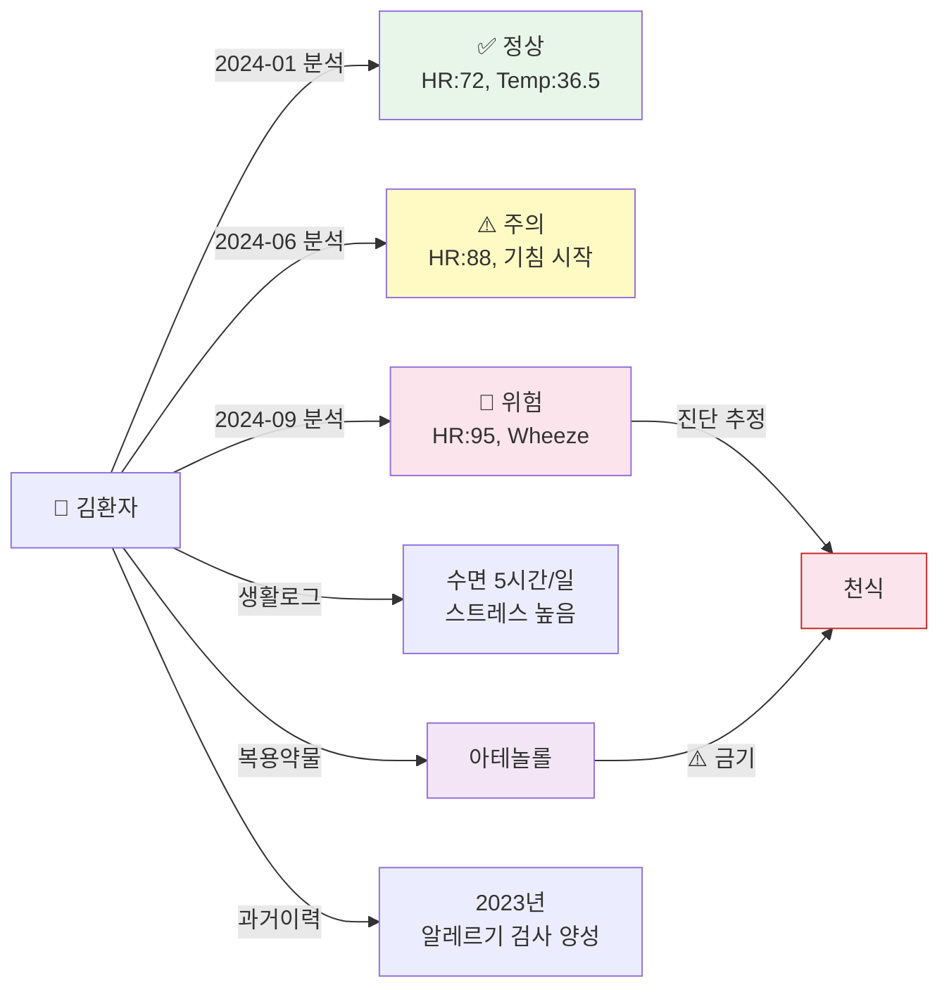

**GraphRAG가 없을 때 vs 있을 때:**

```
❌ GraphRAG 없이 (현재):
   "천명음 감지, 천식 가능성 있습니다."
   → 매번 처음 보는 환자처럼 분석

✅ GraphRAG 적용 후:
   "천명음 감지. 2024년 6월 이후 심박수가 지속 상승 추세이며,
    9월 분석에서도 동일한 Wheeze 패턴이 확인됩니다.
    현재 복용 중인 아테놀롤이 기도 수축을 악화시킬 수 있습니다.
    수면 부족(5시간/일)과 증상 악화 시기가 일치합니다.
    → 만성 기관지 천식으로의 진행 가능성을 고려하여,
    호흡기내과 전문의 방문을 강력히 권장합니다."
```

> 비유하자면, GraphRAG가 없는 AI는 **매번 처음 만나는 의사**이고,
> GraphRAG가 있는 AI는 **10년 동안 나를 봐온 단골 주치의**입니다.

#### 기술 구현 방향

| 구성요소 | 후보 기술 | 역할 |
|---------|----------|------|
| 그래프 DB | Neo4j, KùzuDB | 건강 이력 + 관계 저장 |
| 임베딩 | 의학 텍스트 벡터화 | 증상/진단 유사도 검색 |
| 검색 | Cypher 쿼리 + 벡터 검색 | 관련 이력 자동 탐색 |
| LLM 연동 | 검색 결과 → 프롬프트 주입 | 이력 참조 분석 생성 |

> GraphRAG는 종합 판단 AI의 ReAct 패턴에 **[행동] 사용자 이력 검색** 단계로 통합됩니다.
> 분석이 끝나면 결과가 자동으로 그래프 DB에 저장되어, 다음 분석 시 참조됩니다.

### 11.5 분산 멀티 에이전트 오케스트레이션 (장기)

현재 StethoAgent는 이미 **LangGraph 기반 오케스트레이터**가 7개 전문 에이전트를 조율하는 멀티 에이전트 시스템입니다. 장기적으로는 이를 **분산 아키텍처**로 확장하여, 각 에이전트가 독립 서비스로 배포되고 네트워크를 통해 협업하는 구조로 진화합니다.

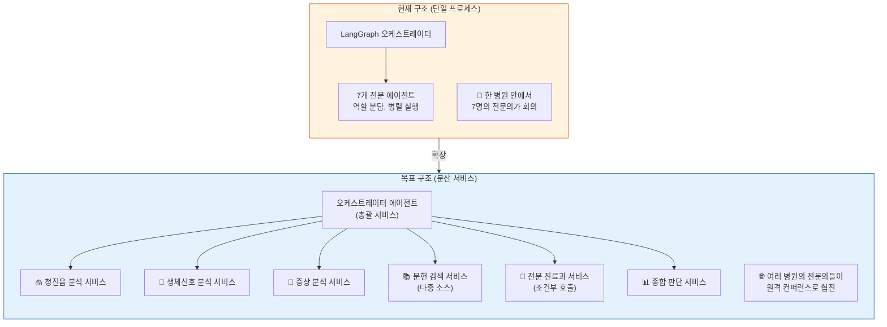

> 분산 구조의 추가 장점:
> - 각 에이전트를 독립적으로 업데이트/확장 가능 (다른 에이전트에 영향 없음)
> - 부하에 따라 특정 에이전트만 서버 증설 가능 (예: 청진음 분석 요청 많으면 해당 서비스만 확장)
> - 에이전트 간 의견 불일치 시 "합의 메커니즘"으로 신뢰도 향상
> - Google A2A Protocol 등 표준 프로토콜 적용 가능

### 11.6 우선순위 로드맵 요약

| 우선순위 | 항목 | 난이도 | 상태 |
|---------|------|--------|------|
| **P0** | PubMed 기본 검색 | 완료 | ✅ 구현 완료 |
| **P1** | PMC 전문 논문 검색 | 중 | 대기 |
| **P1** | ClinicalTrials.gov 연동 | 중 | 대기 |
| **P1** | 호흡기내과 전문 에이전트 | 고 | 대기 |
| **P2** | Google Scholar 연동 | 중 | 대기 |
| **P2** | ICD-11 코드 매핑 | 중 | 대기 |
| **P2** | 약물 상호작용 에이전트 | 중 | 대기 |
| **P2** | GraphRAG 사용자 건강 이력 추적 | 고 | 대기 |
| **P3** | 분산 멀티 에이전트 오케스트레이션 | 고 | 대기 |
| **P3** | UpToDate/DynaMed 연동 | 중 | 대기 |

---

## 12. 향후 비전: TODO 완성 후 시스템

현재 StethoAgent는 7개 에이전트 + PubMed 1개 소스로 동작합니다. 모든 TODO(Section 11)가 구현되면 어떤 시스템이 되는지 살펴보겠습니다.

### 12.1 향후 전체 시스템 구조도

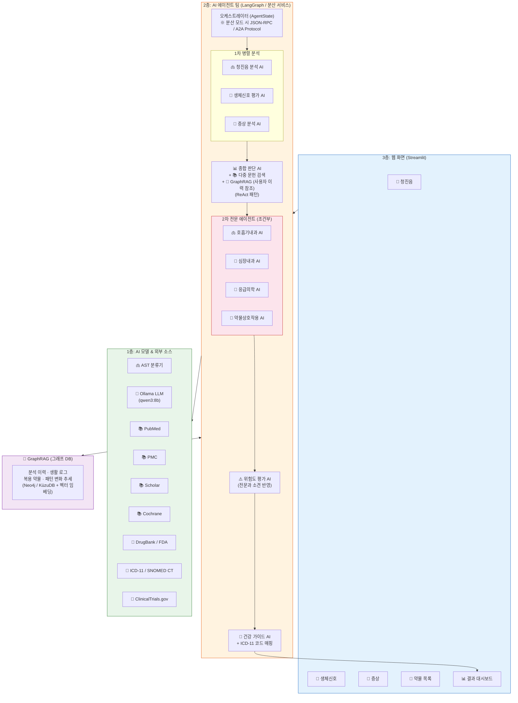

> **현재 → 향후 변화 요약:**
> - 에이전트: 7개 → **11개+** (전문 진료과 4개 추가)
> - 문헌 소스: PubMed 1개 → **7개+** (PMC, Scholar, Cochrane, DrugBank, ICD-11, SNOMED CT, ClinicalTrials.gov)
> - 아키텍처: 단일 프로세스 → **분산 서비스** (독립 배포 가능)
> - **GraphRAG**: 사용자 건강 이력/패턴/생활로그를 그래프 DB로 추적, 진단에 참조
> - 약물 입력 UI 추가, ICD-11 코드 자동 매핑 추가

### 12.2 향후 상태 그래프

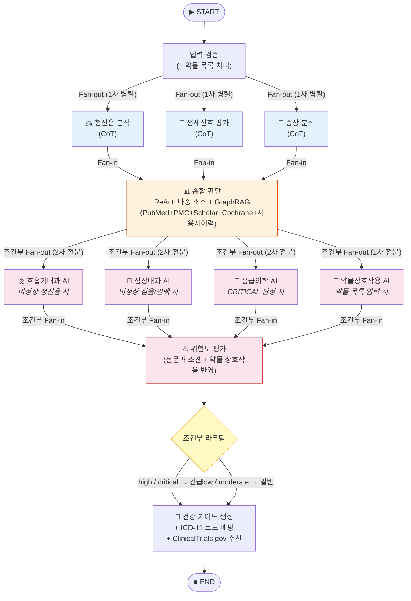

**현재와의 핵심 차이점:**

| 구분 | 현재 | 향후 |
|------|------|------|
| 분석 단계 | 1차 병렬(3개) → 순차 | 1차 병렬(3개) → **2차 조건부 병렬(최대 4개)** → 순차 |
| 문헌 검색 | PubMed 1개 | **PubMed + PMC + Scholar + Cochrane** 동시 검색 |
| 전문과 | 없음 | **호흡기/심장/응급/약물** 조건부 호출 |
| 코드 매핑 | 없음 | **ICD-11 자동 매핑** |
| 임상시험 | 없음 | **ClinicalTrials.gov 추천** |
| 사용자 이력 | 없음 (매번 새로 분석) | **GraphRAG로 과거 이력/패턴/생활로그 참조** |

### 12.3 향후 데이터 흐름

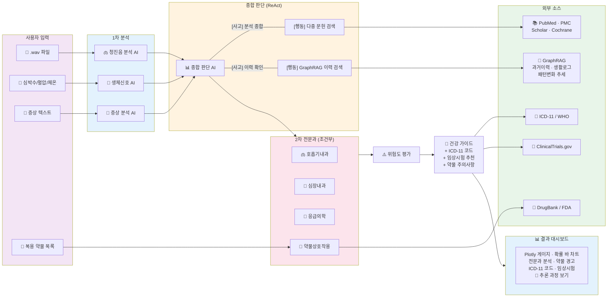

### 12.4 향후 시스템 시연 시나리오

#### 시나리오 A: 만성 기침 환자 (전문과 + 다중 문헌 연동)

```
입력:
  - 청진음: Wheeze (천명음) 감지, 신뢰도 88%
  - 심박수: 95bpm, 혈압: 135/85, 체온: 36.8°C
  - 증상: "3개월 전부터 기침이 계속되고, 특히 밤에 심합니다. 운동하면 숨이 찹니다."
  - 복용 약물: 이부프로펜(진통제), 아테놀롤(혈압약)

1차 분석 (3개 병렬):
  청진음 AI: "천명음(Wheeze) 88% → 기도 협착 시사"
  생체신호 AI: "경도 빈맥 95bpm + 경도 고혈압 → 주의 필요"
  증상 AI: "만성 기침 3개월 + 야간 악화 + 운동 시 호흡곤란 → 천식 패턴"

종합 판단 (ReAct 다중 소스 + GraphRAG):
  [사고] 🧠 "천명음+만성기침+야간악화 → 천식 가능성 높음. 다중 소스+이력에서 확인"
  [행동] ⚡  PubMed 3건 + PMC 전문 2건 + Cochrane 리뷰 1건 + Google Scholar 2건 검색
  [행동] 🔗  GraphRAG: 사용자 과거 이력 검색
  [관찰] 👁️ "Cochrane 리뷰: 야간 기침+천명음의 천식 진단 민감도 78%"
  [관찰] 🔗  "6개월 전 분석에서도 경도 Wheeze 감지. 심박수 72→88→95 상승 추세.
              2023년 알레르기 검사 양성 이력 있음. 최근 수면 5시간/일."
  [결론] ✅  "8건 문헌 + 과거 이력이 일관되게 천식 진행을 시사"

2차 전문과 분석 (조건부):
  🫁 호흡기내과 AI (천명음 감지 → 자동 호출):
    "천명음+만성기침+야간악화+운동유발 호흡곤란
     → 기관지 천식 (ICD-11: CA23) 강력 의심
     → 감별: COPD, 기침 변이 천식, 후비루 증후군
     → 권장 검사: 폐기능 검사(PFT), 기관지 확장제 반응 검사, FeNO
     → GINA 가이드라인 기준 Step 2 치료 시작 고려"

  💊 약물 상호작용 AI (약물 입력 → 자동 호출):
    "⚠️ 주의: 아테놀롤(β-blocker)은 기관지 수축을 유발할 수 있습니다
     → 천식 환자에게 비선택적 β-blocker는 금기
     → 대안: 칼슘 채널 차단제(CCB)로 변경 권장
     → DrugBank 참고: 아테놀롤-천식 상호작용 등급 SEVERE"

위험도: MODERATE (45점) + 전문과 보정 → HIGH로 상향
  (이유: β-blocker 복용 중 천식 의심 → 약물 변경 시급)

건강 가이드 (일반인 모드):
  "현재 폐에서 '쌕쌕' 소리(천명음)가 감지되었고, 3개월간의 기침 증상과
   종합하면 천식 가능성이 있습니다.

   📊 이력 분석: 6개월 전에도 비슷한 소리가 약하게 감지된 적이 있으며,
   심박수가 점차 올라가는 추세입니다. 증상이 진행되고 있을 수 있습니다.

   ⚠️ 중요: 현재 복용 중인 혈압약(아테놀롤)이 기침을 악화시킬 수 있습니다.
   반드시 의사와 상담하여 약물 변경을 논의하세요.

   권장 사항:
   • 호흡기내과 전문의 진료 (폐기능 검사)
   • 혈압약 변경 상담 (현재 약이 기도를 좁힐 수 있음)
   • 수면 시간을 늘려주세요 (현재 5시간 → 7시간 이상 권장)
   • 야간 기침 시 머리를 높이고 습도를 유지하세요

   📚 참고 문헌: 8건 (PubMed 3, PMC 2, Cochrane 1, Scholar 2)
   🔗 이력 참조: 과거 분석 2건, 생활로그 30일분
   🏥 ICD-11: CA23 (기관지 천식)
   🔬 관련 임상시험: NCT04567890 (천식 신약 3상 시험, 서울대병원)"
```

#### 시나리오 B: 응급 상황 (응급의학 AI + 다중 소스 근거)

```
입력:
  - 청진음: Both (수포음+천명음) 감지, 신뢰도 95%
  - 심박수: 145bpm, 혈압: 85/55, 체온: 40.2°C
  - 증상: "어제부터 숨을 못 쉬겠고, 가슴이 아프고, 온몸이 떨립니다"
  - 복용 약물: 메트포르민(당뇨약)

종합 판단 결과:
  → 패혈증 의심, 위험도: CRITICAL (92점)

2차 전문과 분석:
  🫁 호흡기내과 AI: "양측 폐 수포음+천명음 → 중증 폐렴/ARDS 의심"
  💓 심장내과 AI: "저혈압(85/55)+빈맥(145) → 패혈성 쇼크 의심"
  🚨 응급의학 AI (CRITICAL → 자동 호출):
    "🚨 패혈성 쇼크 의심 — 즉시 응급실 이송 필요
     qSOFA 점수: 3/3 (빈맥, 저혈압, 의식변화 의심)
     → 초기 수액 소생 30ml/kg
     → 혈액배양 후 경험적 광범위 항생제
     → 승압제 준비 (norepinephrine 1st line)
     → 트리아지: Level 1 (즉시)"
  💊 약물 상호작용 AI: "메트포르민 — 패혈증 시 젖산산증 위험 ↑ → 즉시 중단 권장"

건강 가이드 (일반인 모드):
  "🚨 긴급 상황: 지금 즉시 119에 전화하거나 가장 가까운 응급실로 가세요.

   현재 상태가 매우 위험합니다:
   • 심장이 매우 빠르게 뛰고 있습니다 (145회/분)
   • 혈압이 매우 낮습니다 (쇼크 위험)
   • 매우 높은 열이 있습니다 (40.2°C)
   • 폐에서 여러 비정상 소리가 들립니다

   ⚠️ 당뇨약(메트포르민)을 지금부터 복용하지 마세요.
   응급실에서 담당 의사에게 복용 약물을 알려주세요.

   📚 근거: 11건의 의학 문헌 확인
   🏥 ICD-11: MG40 (패혈증), CA40 (폐렴)"
```

> **현재 시스템과 향후 시스템의 차이:**
>
> | 항목 | 현재 | 향후 (TODO 완성 후) |
> |------|------|---------------------|
> | 분석 깊이 | "폐렴 가능성" 수준 | CURB-65 점수, GINA Step, qSOFA 등 **전문 지표** 산출 |
> | 약물 안전성 | 없음 | **약물 상호작용 자동 경고** (금기/주의/대안 제시) |
> | 문헌 근거 | PubMed 3건 | **8-15건** (다중 소스, 체계적 리뷰 포함) |
> | 질병 코딩 | 없음 | **ICD-11 자동 매핑** (의료기관 호환) |
> | 임상시험 | 없음 | **참여 가능한 임상시험 자동 추천** |
> | 사용자 이력 | 매번 처음 분석 | **GraphRAG로 과거 패턴/생활로그 참조** ("단골 주치의") |
> | 응급 대응 | "병원 가세요" 수준 | **트리아지 레벨 분류 + 초기 대응 프로토콜** 제시 |

---

## 13. 결론

StethoAgent는 **"여러 전문 AI가 협력하여 건강을 분석하는 시스템"** 의 프로토타입입니다.

핵심 가치:
1. **투명한 AI** — 모든 판단 과정이 기록되고 추적 가능
2. **안전한 AI** — 환자 데이터가 외부로 나가지 않는 로컬 실행
3. **확장 가능한 AI** — 새로운 전문 에이전트를 레고처럼 추가 가능
4. **실용적 AI** — 일반인과 전문가 모두를 위한 이중 모드

이 프로토타입은 4일 만에 구축되었으며, 143개 테스트를 통과한 **동작하는 시스템**입니다.
여기서 출발하여 전문 진료과 에이전트 추가, 클라우드 배포, 멀티 에이전트 오케스트레이션으로 확장할 수 있습니다.

---

> ⚠️ 면책 조항: 본 시스템의 분석 결과는 AI 기반 참고 정보이며 의료 진단이 아닙니다.
> 정확한 진단은 반드시 의료 전문가와 상담하세요.
